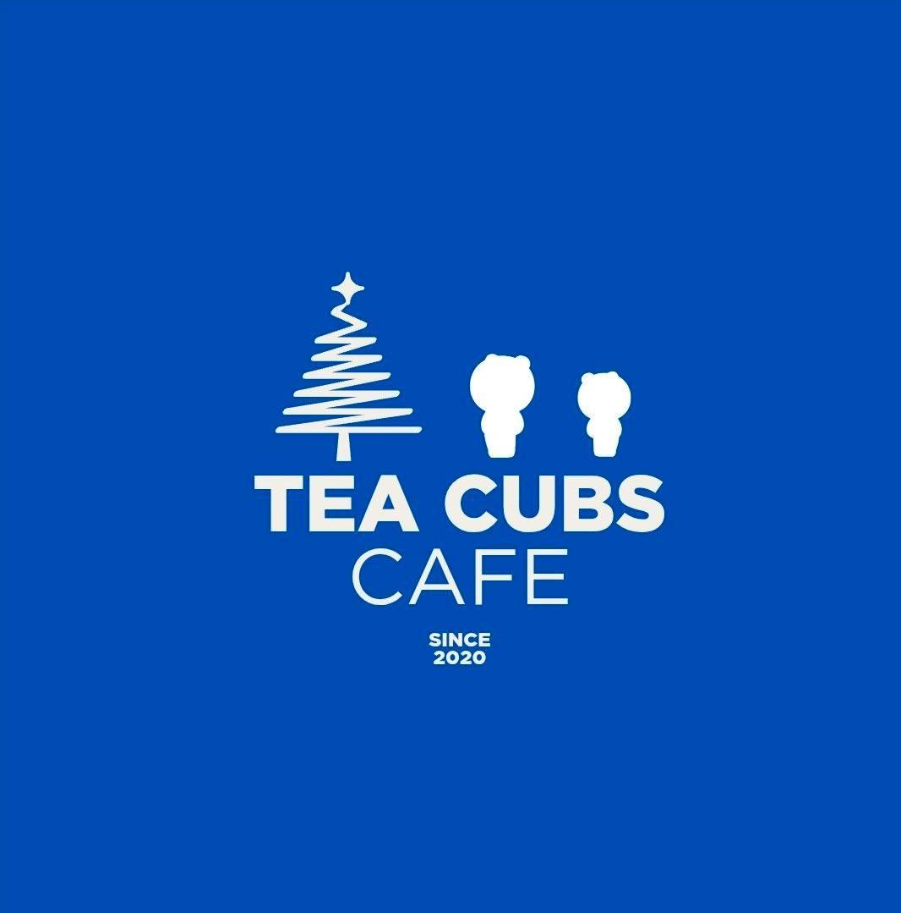

# TeaCubs Cafe - Cozy Study Haven Website

A modern, interactive cafe website designed for students and dreamers.  Features a fully functional shopping cart system, menu filtering, and beautiful animations.  Built with vanilla HTML, CSS, and JavaScript. 

🌐 **Live Demo:** [View Website](https://natszie.github.io/teacubs-cafe/)



## ✨ Features

- 🛒 **Shopping Cart System** - Add items, adjust quantities, and checkout
- ☕ **Interactive Menu** - Tabbed navigation for Brews, Pastries, and Meals
- 🎉 **Happy Hour Promos** - Special 2+1 deals (4PM-7PM daily)
- 📱 **Fully Responsive** - Perfect on all devices
- 🚚 **Delivery Service** - Online ordering with delivery tracking
- 💾 **LocalStorage** - Cart persists between sessions
- 🎨 **Modern UI/UX** - Blue theme with smooth animations
- 🎭 **Parallax Effects** - Engaging scroll animations
- 📦 **Real-time Updates** - Dynamic cart count and totals

## 🛠️ Technologies Used

- **HTML5** - Semantic markup
- **CSS3** - Modern styling with Flexbox, Grid, and Animations
- **JavaScript (ES6+)** - Shopping cart logic, LocalStorage, DOM manipulation
- **Font Awesome** - Icons (via CDN)
- **Google Fonts** - Poppins typography

## 📂 Project Structure

```
teacubs-cafe/
├── index.html          # Main HTML structure
├── styles.css          # Complete styling and responsive design
├── script.js           # Cart system & interactive features
├── images/             # Image assets
│   ├── logo.jpg        # TeaCubs logo
│   ├── promo-drinks.jpg
│   └── cafe-interior.jpg
└── README.md           # Documentation
```

## 🚀 Quick Start

### Local Setup

1. **Clone the repository**
   ```bash
   git clone https://github.com/Natszie/teacubs-cafe.git
   cd teacubs-cafe
   ```

2. **Open in browser**
   - Double-click `index.html`, or
   - Use Live Server in VS Code
   - Or open with any modern browser

No build process or dependencies needed!  Pure vanilla JavaScript. 

## 📋 Sections Overview

### 1. **Hero Section**
- Full-screen landing with floating icons animation
- Parallax scroll effect
- "Since 2020" badge
- Call-to-action buttons

### 2. **About Section**
- Study Hub features
- Artisan brews description
- Fresh delights showcase
- Hover animations on cards

### 3. **Promos Section** ⭐
- **Happy Hour Special**: Buy 2 Get 1 FREE (4PM-7PM daily)
- Promo image gallery
- Cafe interior photos
- Time-limited offers

### 4. **Menu Section** ☕
Interactive tabbed menu with 3 categories: 

**Brews:**
- Honey Lavender Latte (₱165)
- Matcha Cloud (₱180)
- Earl Grey Supreme (₱135)
- Brown Sugar Boba (₱175)
- Caramel Macchiato (₱160)
- Berry Bliss Tea (₱145)

**Pastries:**
- Butter Croissant (₱105)
- Matcha Cheesecake (₱195)
- Blueberry Muffin (₱120)
- Double Chocolate Cookie (₱98)
- Apple Cinnamon Tart (₱165)
- Honey Glazed Donut (₱115)

**Meals:**
- Garden Fresh Salad (₱285)
- Turkey Avocado Panini (₱325)
- Creamy Pesto Pasta (₱345)
- Mediterranean Wrap (₱295)
- Tomato Basil Soup (₱255)
- All-Day Breakfast Bowl (₱310)

### 5. **Shopping Cart System** 🛒
- Add to cart from any menu item
- Adjust quantities (+/-)
- Remove items
- Real-time price calculation
- Subtotal, delivery fee, and total
- Free delivery on orders over ₱900
- Persistent cart (LocalStorage)
- Smooth animations and notifications

### 6. **Delivery Section**
- Fast delivery (30-45 mins)
- Careful packaging
- Multiple payment options
- Minimum order: ₱450
- Delivery fee: ₱120

### 7. **Ambiance Section**
- Cozy atmosphere with warm lighting
- Ambient lo-fi music
- Free WiFi and power outlets
- Green space with plants

### 8. **Contact Section**
- Location details
- Operating hours (7am-10pm weekdays, 8am-11pm weekends)
- Contact information
- Social media links

### 9. **Footer**
- Quick navigation links
- Services overview
- Social media connections
- Copyright and badges

## 🎨 Color Palette

```css
--primary-blue: #1a5fb4;       /* Main brand color */
--primary-dark: #14478a;       /* Hover states */
--primary-light: #2e7fd4;      /* Accents */
--white: #FFFFFF;              /* Text on dark */
--off-white: #F8F9FA;          /* Background */
--light-blue: #E3F2FD;         /* Light sections */
--accent-blue: #3b82f6;        /* Highlights */
--text-dark: #1a1a1a;          /* Main text */
--text-gray:  #6c757d;          /* Secondary text */
```

## 🔧 Customization Guide

### Change Cafe Name & Logo

**In `index.html` (Line 14):**
```html

```

Update in: 
- Navigation (Line 14)
- Hero title (Line 85)
- Footer (Line 610)
- Page title (Line 5)

### Update Menu Items

**Add new item in `index.html`:**
```html
<div class="menu-item" 
     data-id="19" 
     data-name="Your Item Name" 
     data-price="150" 
     data-emoji="☕">
    <div class="menu-item-img">☕</div>
    <div class="menu-item-content">
        <h3>Your Item Name</h3>
        <p>Delicious description here</p>
        <div class="menu-item-footer">
            <span class="price">₱150</span>
            <button class="add-btn">Add to Order</button>
        </div>
    </div>
</div>
```

**Important:** Each item needs unique `data-id`, `data-name`, `data-price`, and `data-emoji` attributes for the cart to work properly.

### Modify Cart Settings

**In `script.js` (Line 271-277):**
```javascript
function updateCartSummary() {
    const subtotal = cart.reduce((sum, item) => sum + (item.price * item.quantity), 0);
    const deliveryFee = subtotal >= 900 ? 0 :  120; // Change free delivery threshold
    const total = subtotal + deliveryFee;
    // ... 
}
```

### Change Colors

**In `styles.css` (Lines 8-17):**
```css
:root {
    --primary-blue: #your-color;
    --primary-dark: #your-color;
    --primary-light: #your-color;
    /* Update other color variables */
}
```

### Update Promo Details

**In `index.html` (Lines 128-160):**
- Change promo image
- Update deal description
- Modify happy hour times
- Edit promo features

### Update Contact Information

**In `index.html` (Lines 554-577):**

**Location:**
```html
<p>Your Address<br>Your City<br>Your Country</p>
```

**Hours:**
```html
<p>Monday - Friday: 7am - 10pm<br>Saturday:  8am - 11pm<br>Sunday: 8am - 9pm</p>
```

**Contact:**
```html
<p>Phone: (XX) XXXX-XXXX<br>Email: hello@yourcafe.com<br>Instagram: @yourcafe</p>
```

## 🛒 Shopping Cart Features

### How It Works

1. **Add to Cart** - Click "Add to Order" on any menu item
2. **View Cart** - Click cart button (🛒) in navigation
3. **Adjust Quantity** - Use +/- buttons
4. **Remove Items** - Click trash icon (🗑️)
5. **Checkout** - Click "Proceed to Checkout" button

### Cart Calculations

- **Subtotal**: Sum of all items × quantities
- **Delivery Fee**: ₱120 (FREE if order ≥ ₱900)
- **Total**: Subtotal + Delivery Fee

### Data Persistence

Cart data is saved to browser's LocalStorage:
- Survives page refreshes
- Persists across sessions
- Cleared on checkout
- Accessible via:  `localStorage.getItem('teacubsCart')`

## 📱 Responsive Design

| Device | Breakpoint | Features |
|--------|-----------|----------|
| Desktop | 1200px+ | Full layout, all features |
| Tablet | 768px - 1199px | Adjusted grids |
| Mobile | < 768px | Hamburger menu, single column |

## 🌐 Deployment

### GitHub Pages (Free)

1. **Push to GitHub**
   ```bash
   git init
   git add .
   git commit -m "Initial commit:  TeaCubs Cafe"
   git branch -M main
   git remote add origin https://github.com/Natszie/teacubs-cafe.git
   git push -u origin main
   ```

2. **Enable GitHub Pages**
   - Go to repository Settings
   - Click "Pages" in sidebar
   - Source: Deploy from branch
   - Branch: `main`, Folder: `/ (root)`
   - Save and wait 1-2 minutes
   - Site live at:  `https://natszie.github.io/teacubs-cafe/`

### Netlify

1. Drag and drop project folder to [Netlify Drop](https://app.netlify.com/drop)
2. Instant deployment! 

### Vercel

```bash
npm i -g vercel
vercel
```

## 🔌 Backend Integration (Optional)

The cart currently works on frontend only. To add real ordering:

### Option 1: Firebase

```javascript
// Add Firebase SDK
import { initializeApp } from "firebase/app";
import { getFirestore, collection, addDoc } from "firebase/firestore";

// Save order to Firestore
async function saveOrder(orderData) {
    const db = getFirestore();
    await addDoc(collection(db, "orders"), orderData);
}
```

### Option 2: REST API

```javascript
async function checkout() {
    const orderData = {
        items: cart,
        total: calculateTotal(),
        timestamp: new Date()
    };
    
    const response = await fetch('https://your-api.com/orders', {
        method: 'POST',
        headers: { 'Content-Type': 'application/json' },
        body: JSON.stringify(orderData)
    });
}
```

## 🐛 Browser Support

| Browser | Supported |
|---------|-----------|
| Chrome | ✅ Latest |
| Firefox | ✅ Latest |
| Safari | ✅ Latest |
| Edge | ✅ Latest |
| Opera | ✅ Latest |

**Minimum Requirements:**
- ES6 JavaScript support
- LocalStorage API
- CSS Grid & Flexbox
- Modern browser from 2018+

## ⚡ Performance

- **Lightweight**:  No frameworks (React, Vue, etc.)
- **Fast Loading**: Minimal dependencies
- **Optimized**: Fonts from Google CDN
- **No Build Process**: Ready to deploy
- **LocalStorage**: Fast cart operations

## 📈 Future Enhancements

- [ ] User authentication (login/signup)
- [ ] Order history tracking
- [ ] Payment gateway integration (PayMongo, GCash)
- [ ] Real-time order tracking
- [ ] Customer reviews and ratings
- [ ] Loyalty rewards program
- [ ] Email notifications
- [ ] Admin dashboard for orders
- [ ] Menu management system
- [ ] Inventory tracking
- [ ] Multi-language support
- [ ] Dark mode toggle
- [ ] Progressive Web App (PWA)
- [ ] Push notifications

## 🔒 Security Notes

- Cart data stored locally (not secure for production)
- No payment processing (add Stripe/PayMongo for real payments)
- Sanitize user inputs before backend integration
- Use HTTPS in production
- Implement rate limiting for API calls
- Add CSRF protection for forms

## 📄 License

This project is open source and available under the MIT License.

**Free to use for:**
- Personal projects ✅
- Commercial projects ✅
- Learning and education ✅
- Modification ✅
- Distribution ✅

Attribution appreciated but not required!

## 👨‍💻 Developer

**Nathaniel Arquiza**  
Junior Web Developer

- 🌐 Portfolio: [natszie.github.io/portfolio](https://natszie.github.io/portfolio)
- 💼 GitHub: [@Natszie](https://github.com/Natszie)
- 📧 Email:  nathanielcarquiza@gmail.com
- 🔗 LinkedIn:  [Nathaniel Arquiza](https://www.linkedin.com/in/nathaniel-arquiza-ba29653a0/)
- 📍 Location: Guimba, Nueva Ecija, Philippines

**Available for:**
- Freelance web development projects
- E-commerce website development
- Shopping cart implementations
- Responsive design work
- JavaScript applications

## 🙏 Acknowledgments

- **Google Fonts** - Poppins typography
- **Font Awesome** - Icons (if used)
- **Inspiration** - Modern cafe and study space designs
- **Students** - Who inspired this cozy study cafe concept

## 💡 Key Learning Points

This project demonstrates:
- ✅ Shopping cart implementation from scratch
- ✅ LocalStorage for data persistence
- ✅ Complex state management without frameworks
- ✅ Dynamic DOM manipulation
- ✅ Real-time calculations
- ✅ Modal windows and overlays
- ✅ Responsive design patterns
- ✅ CSS animations and transitions
- ✅ Event handling and delegation
- ✅ Array methods (map, filter, reduce)

## 📞 Support

Found a bug or have a suggestion? 

- Open an issue on [GitHub](https://github.com/Natszie/teacubs-cafe/issues)
- Contact via [email](mailto:nathanielcarquiza@gmail.com)
- Connect on [LinkedIn](https://www.linkedin.com/in/nathaniel-arquiza-ba29653a0/)

## 🌟 Show Your Support

If you found this project helpful: 

- ⭐ Star this repository on GitHub
- 🍴 Fork it for your own projects
- 📢 Share it with others
- 💬 Leave feedback or suggestions
- ☕ Try ordering from the menu (demo only!)

## 📚 Documentation

### Cart API Reference

```javascript
// Add item to cart
addToCart(item)

// Remove item from cart
removeFromCart(itemId)

// Update item quantity
updateQuantity(itemId, change)

// Get cart total
const total = cart.reduce((sum, item) => sum + (item.price * item.quantity), 0)

// Clear cart
cart = []
saveCart()
```

### LocalStorage Structure

```json
{
  "teacubsCart": [
    {
      "id": "1",
      "name": "Honey Lavender Latte",
      "price": 165,
      "emoji": "☕",
      "quantity": 2
    }
  ]
}
```

## 🎓 Educational Use

Perfect for learning: 
- Shopping cart logic
- LocalStorage implementation
- DOM manipulation
- Event handling
- State management
- Responsive design
- Modern CSS techniques

## 💻 Code Quality

- ✅ Semantic HTML5
- ✅ Modern CSS3 (Grid, Flexbox)
- ✅ ES6+ JavaScript
- ✅ Commented code
- ✅ Organized structure
- ✅ Responsive design
- ✅ Cross-browser compatible

---

**Made with ❤️ and ☕ for Students**

*Your cozy corner for productivity and peace since 2020*

Last Updated: January 2026

🎉 **Happy Hour:  4PM-7PM Daily - Buy 2 Get 1 FREE!**